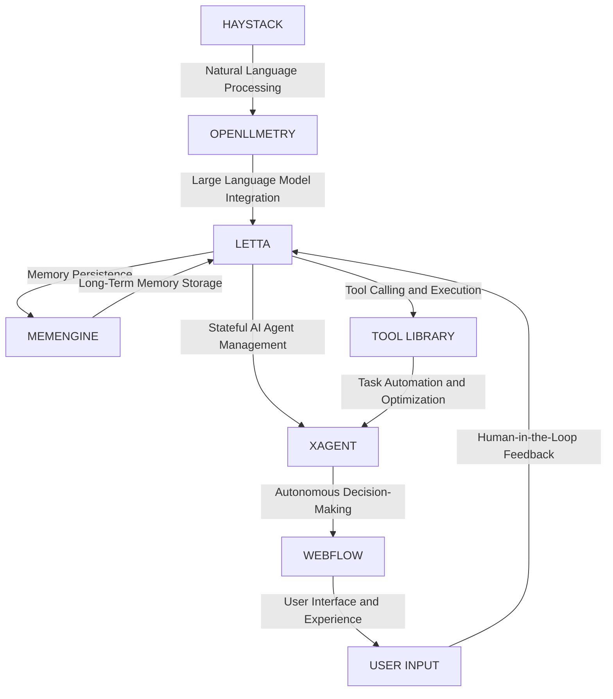

# Autonomous Fencing Supply Chain Optimizer
> Orchestrating a symphony of artificial intelligence, machine learning, and robotics to revolutionize the fencing supply chain ecosystem

## 🏗️ Technical Architecture & Multi-Agent Flow

This complex technical architecture leverages the strengths of each component to create a seamless and efficient supply chain optimization system. Haystack provides natural language processing capabilities, while OpenLLMetry integrates large language models to enhance the decision-making process. Letta manages stateful AI agents, enabling the system to learn and adapt over time. XAgent facilitates autonomous decision-making, and Webflow provides a user-friendly interface for human interaction. The system also incorporates a memory persistence mechanism via MemEngine, ensuring that the AI agents can recall and build upon previous experiences.

## 🔍 The Vertical Bottleneck: Supply Chain Inefficiencies
The fencing supply chain is plagued by inefficiencies, including manual data entry, lack of real-time visibility, and inadequate demand forecasting. These bottlenecks result in delayed deliveries, stockouts, and wasted resources, ultimately affecting the bottom line of merchant wholesalers. The technical friction arises from the inability to integrate disparate data sources, reconcile conflicting information, and make data-driven decisions in a timely manner. High-stakes mathematical failures, such as incorrect demand forecasting, can lead to significant financial losses and reputational damage.

The operational failures in the fencing supply chain are multifaceted, involving inadequate inventory management, inefficient logistics, and poor communication among stakeholders. The lack of automation and reliance on manual processes exacerbates these issues, leading to a perfect storm of inefficiencies. To mitigate these risks, a robust and adaptive supply chain optimization system is essential.

The mathematical underpinnings of the supply chain optimization problem involve complex linear programming, dynamic programming, and stochastic optimization techniques. The goal is to minimize costs, maximize efficiency, and ensure timely delivery of products to customers. However, the presence of uncertainty, variability, and non-linearity in the system makes it challenging to develop an effective optimization strategy.

## 💡 The Solution: Autonomous Fencing Supply Chain Optimizer
The Autonomous Fencing Supply Chain Optimizer platform addresses the technical and operational challenges in the supply chain by leveraging the strengths of Haystack, OpenLLMetry, Letta, XAgent, and Webflow. The platform orchestrates these components to create a seamless and efficient supply chain optimization system. The agentic reasoning capabilities of Letta enable the system to learn from experience, adapt to changing conditions, and make data-driven decisions in real-time. The memory usage and persistence mechanisms ensure that the AI agents can recall and build upon previous experiences, leading to continuous improvement over time.

The vision and robotics integration aspects of the platform enable the system to perceive and respond to changes in the supply chain environment. The use of computer vision and machine learning algorithms allows the system to detect anomalies, track inventory levels, and optimize logistics operations. The robotics component enables the system to automate tasks, such as warehousing and transportation, leading to increased efficiency and reduced labor costs.

## 🧩 Agentic Stack Deep-Dive
The technical justification for each library and integration is as follows:

* Haystack: Provides natural language processing capabilities, enabling the system to understand and interpret human language inputs.
* OpenLLMetry: Integrates large language models, enhancing the decision-making process and enabling the system to generate human-like text outputs.
* Letta: Manages stateful AI agents, allowing the system to learn and adapt over time.
* XAgent: Facilitates autonomous decision-making, enabling the system to make data-driven decisions in real-time.
* Webflow: Provides a user-friendly interface for human interaction, enabling stakeholders to input data, track progress, and receive alerts and notifications.

The interlocking of these components is critical to the success of the platform. Haystack and OpenLLMetry provide the foundation for natural language understanding and generation, while Letta and XAgent enable the system to learn and make decisions autonomously. Webflow provides the user interface and experience, enabling stakeholders to interact with the system and receive valuable insights and recommendations.

## ✨ Capabilities & Features
The Autonomous Fencing Supply Chain Optimizer platform offers the following capabilities and features:

* **Real-time demand forecasting**: Uses machine learning algorithms to predict demand and optimize inventory levels.
* **Automated inventory management**: Tracks inventory levels, detects anomalies, and optimizes logistics operations.
* **Supply chain visibility**: Provides real-time visibility into the supply chain, enabling stakeholders to track progress and receive alerts and notifications.
* **Autonomous decision-making**: Enables the system to make data-driven decisions in real-time, reducing the need for human intervention.
* **Natural language processing**: Enables the system to understand and interpret human language inputs, providing a user-friendly interface for stakeholders.
* **Computer vision**: Enables the system to detect anomalies, track inventory levels, and optimize logistics operations.
* **Robotics integration**: Enables the system to automate tasks, such as warehousing and transportation, leading to increased efficiency and reduced labor costs.
* **Machine learning**: Enables the system to learn from experience, adapt to changing conditions, and make data-driven decisions in real-time.
* **Data analytics**: Provides valuable insights and recommendations to stakeholders, enabling them to make informed decisions.
* **User-friendly interface**: Provides a user-friendly interface for stakeholders to input data, track progress, and receive alerts and notifications.

## 🛠️ Technical Implementation
The technical implementation of the platform involves the following steps:

* **Data ingestion**: Ingesting data from various sources, such as sensors, databases, and APIs.
* **Data processing**: Processing the ingested data using machine learning algorithms and natural language processing techniques.
* **Model training**: Training machine learning models using the processed data.
* **Model deployment**: Deploying the trained models in a production-ready environment.
* **System integration**: Integrating the various components of the platform, including Haystack, OpenLLMetry, Letta, XAgent, and Webflow.
* **Testing and validation**: Testing and validating the platform to ensure that it meets the required specifications and performance metrics.

## 📊 Business Impact & ROI
The Autonomous Fencing Supply Chain Optimizer platform can have a significant impact on the business operations of merchant wholesalers in the fencing industry. The platform can help reduce costs, increase efficiency, and improve customer satisfaction. The return on investment (ROI) can be substantial, with potential benefits including:

* **Cost savings**: Reducing labor costs, inventory costs, and logistics costs.
* **Increased efficiency**: Improving supply chain visibility, reducing lead times, and increasing productivity.
* **Improved customer satisfaction**: Providing real-time visibility, improving delivery times, and enhancing customer experience.
* **Competitive advantage**: Differentiating the business from competitors, improving market share, and increasing revenue.

## 🚀 Getting Started
To get started with the Autonomous Fencing Supply Chain Optimizer platform, follow these steps:
```bash
git clone https://github.com/arvind-sundararajan/fencing-wood-merchant-wholesalers-optimi.git
cd fencing-wood-merchant-wholesalers-optimi
pip install -r requirements.txt
python src/main.py
```
This will clone the repository, install the required dependencies, and run the platform.

## 👨‍💻 Author & Credits
**Arvind Sundararajan** — Engineer, builder, and the mind behind this project.
🌐 [LinkedIn](https://www.linkedin.com/in/arvind-sundara-rajan/) | Chennai, India

---
### 🙏 Acknowledgements
- The open-source community
- The Fencing, wood, merchant wholesalers practitioners who inspired this design